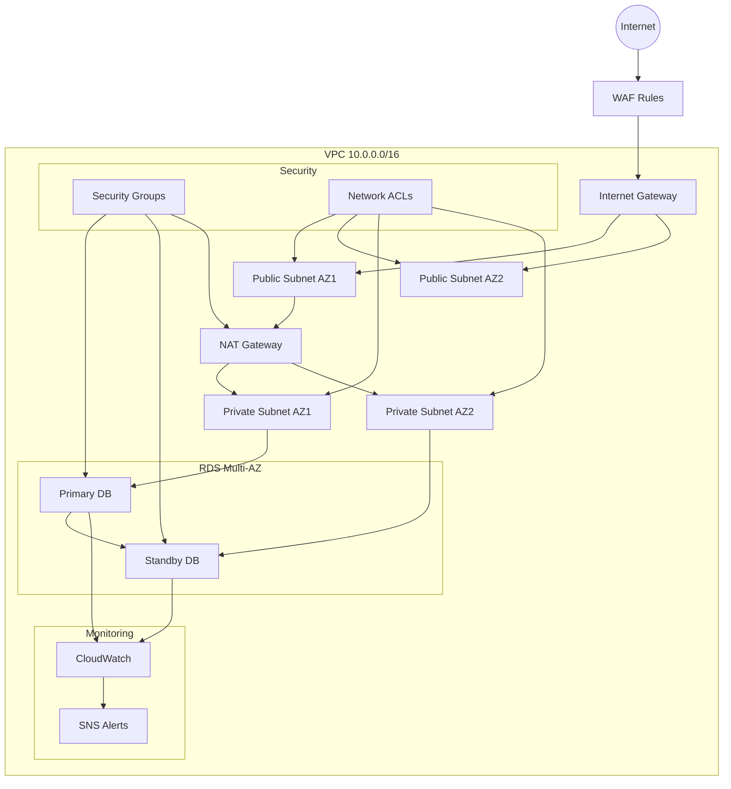

# AWS PostgreSQL Infrastructure Architecture

## Viewing the Infrastructure Diagram

To view this diagram:
1. Visit [mermaid.live](https://mermaid.live)
2. Copy the entire code block below (from ```mermaid to ```)
3. Paste it into the left panel of mermaid.live
4. The diagram will render automatically in the right panel

## Infrastructure Flow Diagram



## Component Details

### Networking
- **VPC**: 10.0.0.0/16
  - Public Subnets: For NAT Gateway
  - Private Subnets: For RDS instances
- **Internet Gateway**: For public internet access
- **NAT Gateway**: For private subnet internet access

### Database
- **RDS PostgreSQL**:
  - Multi-AZ deployment
  - Automated backups
  - Performance insights enabled
  - Encrypted storage

### Security
- **Security Groups**: Firewall rules at instance level
- **NACLs**: Subnet-level network ACLs
- **WAF**: Web Application Firewall rules

### Monitoring
- **CloudWatch**:
  - CPU utilization alerts
  - Storage space monitoring
  - Connection count tracking
- **SNS**: Alert notifications
